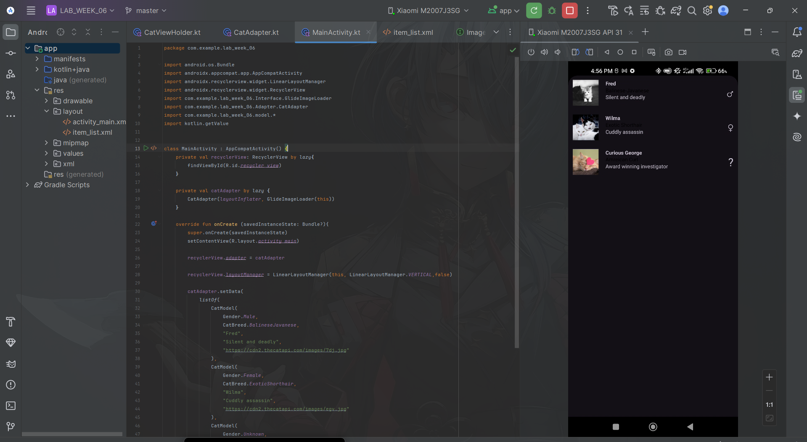
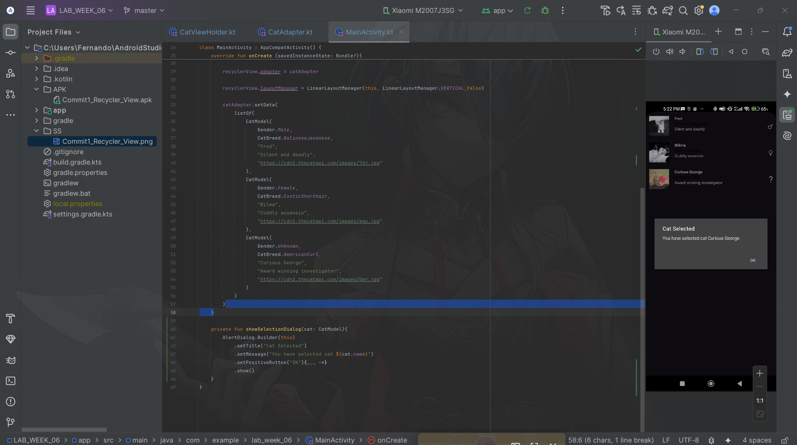
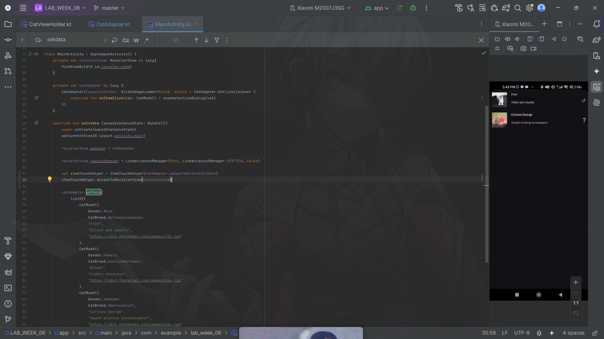
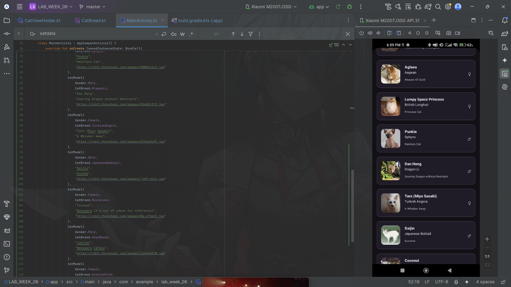

### Submitted by:
* **Nama:** Fernando Sunarto
* **NIM:** 00000083441
* **Class:** AL
---

### Project Files
| Commit | Description | APK Download | Screenshot Preview |
| :---: |-----------------------------|:---:|:---:|
| **01** | **Recycler View** | [📱 Download APK](APK/Commit1_Recycler_View.apk) |  |
| **02** | **Clickable Recycler View** | [📱 Download APK](APK/Commit2_Recycler_Clickable.apk) |  |
| **03** | **Deleting Item By Swiping** | [📱 Download APK](APK/Commit3_Deleting_Item_By_Swiping.apk) |  |
| **04** | **Assignment** | [📱 Download APK](APK/Commit4_Assignment.apk) |  |

### Code that Changed for Assignment
1. build.gradle.kts(:app):
```diff
 dependencies {
+    implementation (libs.androidx.cardview)
     implementation(libs.glide)
     implementation(libs.androidx.core.ktx)
     implementation(libs.androidx.appcompat)
```
Description: add Cardview

2. item_list.xml:
```diff
-<?xml version="1.0" encoding="utf-8"?>
-<androidx.constraintlayout.widget.ConstraintLayout xmlns:android="http://schemas.android.com/apk/res/android"
-    android:layout_width="match_parent"
-    android:layout_height="wrap_content"
+<com.google.android.material.card.MaterialCardView
+    xmlns:android="http://schemas.android.com/apk/res/android"
     xmlns:app="http://schemas.android.com/apk/res-auto"
     xmlns:tools="http://schemas.android.com/tools"
+    android:id="@+id/cat_card"
+    android:layout_width="match_parent"
+    android:layout_height="wrap_content"
+    android:layout_marginHorizontal="16dp"
+    android:layout_marginVertical="8dp"
+    app:cardElevation="2dp"
+    app:cardCornerRadius="12dp">
-    android:padding="10dp">
-
-    <ImageView
-        android:id="@+id/cat_photo"
-        android:layout_width="60dp"
-        android:layout_height="60dp"
-        app:layout_constraintStart_toStartOf="parent"
-        app:layout_constraintTop_toTopOf="parent"
-        tools:background="@color/material_dynamic_neutral50"
-        />
-
-    <TextView
-        android:id="@+id/cat_name"
-        android:layout_width="wrap_content"
-        android:layout_height="wrap_content"
-        android:layout_marginStart="16dp"
-        android:textStyle="bold"
-        app:layout_constraintStart_toEndOf="@+id/cat_photo"
-        app:layout_constraintTop_toTopOf="parent"
-        tools:text="Cat Name"/>
-
-    <TextView
-        android:id="@+id/cat_breed"
-        android:layout_width="wrap_content"
-        android:layout_height="wrap_content"
-        android:textColor= "@color/black"
-        app:layout_constraintStart_toStartOf="@+id/cat_name"
-        app:layout_constraintTop_toBottomOf="@+id/cat_name"
-        tools:text="Cat Breed"/>
-
-    <TextView
-        android:id="@+id/cat_biography"
-        android:layout_width="wrap_content"
-        android:layout_height="wrap_content"
-        app:layout_constraintStart_toStartOf="@+id/cat_breed"
-        app:layout_constraintTop_toBottomOf="@+id/cat_breed"
-        tools:text="Cat Biography"/>
-    <TextView
-        android:id="@+id/cat_gender"
-        android:layout_width="wrap_content"
+    <androidx.constraintlayout.widget.ConstraintLayout
+        android:layout_width="match_parent"
         android:layout_height="wrap_content"
-        android:textSize="30sp"
-        app:layout_constraintBottom_toBottomOf="parent"
-        app:layout_constraintEnd_toEndOf="parent"
-        app:layout_constraintTop_toTopOf="parent"
-        tools:text="Cat Gender"/>
+        android:padding="16dp">
+
+        <com.google.android.material.imageview.ShapeableImageView
+            android:id="@+id/cat_photo"
+            android:layout_width="70dp"
+            android:layout_height="70dp"
+            android:scaleType="centerCrop"
+            app:layout_constraintStart_toStartOf="parent"
+            app:layout_constraintTop_toTopOf="parent"
+            app:layout_constraintBottom_toBottomOf="parent"
+            app:shapeAppearanceOverlay="@style/ShapeAppearance.Material3.Corner.Medium" />
+
+        <TextView
+            android:id="@+id/cat_name"
+            android:layout_width="0dp"
+            android:layout_height="wrap_content"
+            android:layout_marginStart="16dp"
+            android:layout_marginEnd="8dp"
+            android:textAppearance="?attr/textAppearanceTitleMedium"
+            android:textStyle="bold"
+            app:layout_constraintEnd_toStartOf="@+id/cat_gender"
+            app:layout_constraintStart_toEndOf="@+id/cat_photo"
+            app:layout_constraintTop_toTopOf="parent"
+            tools:text="Cat Name" />
+
+        <TextView
+            android:id="@+id/cat_breed"
+            android:layout_width="0dp"
+            android:layout_height="wrap_content"
+            android:layout_marginTop="2dp"
+            android:textAppearance="?attr/textAppearanceBodyMedium"
+            app:layout_constraintEnd_toEndOf="@+id/cat_name"
+            app:layout_constraintStart_toStartOf="@+id/cat_name"
+            app:layout_constraintTop_toBottomOf="@+id/cat_name"
+            tools:text="Cat Breed" />
+
+        <TextView
+            android:id="@+id/cat_biography"
+            android:layout_width="0dp"
+            android:layout_height="wrap_content"
+            android:layout_marginTop="4dp"
+            android:textAppearance="?attr/textAppearanceBodySmall"
+            android:textColor="?attr/colorOnSurfaceVariant"
+            app:layout_constraintEnd_toEndOf="@+id/cat_name"
+            app:layout_constraintStart_toStartOf="@+id/cat_breed"
+            app:layout_constraintTop_toBottomOf="@+id/cat_breed"
+            app:layout_constraintBottom_toBottomOf="parent"
+            app:layout_constrainedHeight="true"
+            tools:text="Cat Biography" />
+
+        <TextView
+            android:id="@+id/cat_gender"
+            android:layout_width="wrap_content"
+            android:layout_height="wrap_content"
+            android:textSize="24sp"
+            app:layout_constraintBottom_toBottomOf="parent"
+            app:layout_constraintEnd_toEndOf="parent"
+            app:layout_constraintTop_toTopOf="parent"
+            tools:text="Cat Gender" />
+
+    </androidx.constraintlayout.widget.ConstraintLayout>
 
-</androidx.constraintlayout.widget.ConstraintLayout>
+</com.google.android.material.card.MaterialCardView>
```
Description: Modify XML code to Implements Cardview

3. CatBreed.kt:
```diff   
enum class CatBreed {
-    AmericanCurl, BalineseJavanese, ExoticShorthair
+    AmericanCurl, BalineseJavanese, ExoticShorthair, Aegean, BritishLonghair, Sphynx,
+    DragonLi, TurkishAngora, JapaneseBobtail,Mainecoon, KhaoManee, ScotishFold
```
Description: Add another Catbreed from 3 into 12 cat breed

4. CatViewHolder.kt:
```diff
             CatBreed.AmericanCurl -> "Amreican Curl"
             CatBreed.BalineseJavanese -> "Balinese-Javanese"
             CatBreed.ExoticShorthair -> "Exotic Shorthair"
+            CatBreed.Aegean -> "Aegean"
+            CatBreed.BritishLonghair -> "British Longhair"
+            CatBreed.Sphynx -> "Sphynx"
+            CatBreed.DragonLi -> "Dragon Li"
+            CatBreed.TurkishAngora -> "Turkish Angora"
+            CatBreed.JapaneseBobtail -> "Japanese Bobtail"
+            CatBreed.Mainecoon -> "Maine Coon"
+            CatBreed.KhaoManee -> "Khao Manee"
+            CatBreed.ScotishFold -> "Scotish Fold"
```
Description: Add Catbreed in function bindData according to Catbreed.kt

5. MainActivity.kt:
```diff
                     "Curious George",
                     "Award winning investigator",
                     "https://cdn2.thecatapi.com/images/bar.jpg"
+                ),
+                CatModel(
+                    Gender.Female,
+                    CatBreed.Aegean,
+                    "Aglaea",
+                    "Weaver Of Gold",
+                    "https://cdn2.thecatapi.com/images/uvt2Psd9O.jpg"
+                ),
+                CatModel(
+                    Gender.Female,
+                    CatBreed.BritishLonghair,
+                    "Lumpy Space Princess",
+                    "Princess Cat",
+                    "https://cdn2.thecatapi.com/images/7isAO4Cav.jpg"
+                ),
+                CatModel(
+                    Gender.Male,
+                    CatBreed.Sphynx,
+                    "Punkie",
+                    "Hairless Cat",
+                    "https://cdn2.thecatapi.com/images/HBWdtLpif.jpg"
+                ),
+                CatModel(
+                    Gender.Male,
+                    CatBreed.DragonLi,
+                    "Dan Heng",
+                    "Soaring Dragon without Restraint",
+                    "https://cdn2.thecatapi.com/images/DUxU01IY5.jpg"
+                ),
+                CatModel(
+                    Gender.Female,
+                    CatBreed.TurkishAngora,
+                    "Taro (Miyo Sasaki)",
+                    "A Whisker Away",
+                    "https://cdn2.thecatapi.com/images/DYOqsRy9f.jpg"
+                ),
+                CatModel(
+                    Gender.Male,
+                    CatBreed.JapaneseBobtail,
+                    "Daijin",
+                    "Suzume",
+                    "https://cdn2.thecatapi.com/images/-tm9-znzl.jpg"
+                ),
+                CatModel(
+                    Gender.Female,
+                    CatBreed.Mainecoon,
+                    "Coconut",
+                    "Nekopara (I'm out of ideas for reference)",
+                    "https://cdn2.thecatapi.com/images/Wq_eTQalE.jpg"
+                ),
+                CatModel(
+                    Gender.Male,
+                    CatBreed.KhaoManee,
+                    "Laurier",
+                    "Nekopara Catboy",
+                    "https://cdn2.thecatapi.com/images/165ok6ESN.jpg"
+                ),
+                CatModel(
+                    Gender.Female,
+                    CatBreed.ScotishFold,
+                    "Cinnamon",
+                    "Nekopara (again)",
+                    "https://cdn2.thecatapi.com/images/dkN5wGUxC.jpg"
                 )
             )
         )
```
Description: Add Data into the CatModel so from 3 Cat Model into 12 Cat Model
